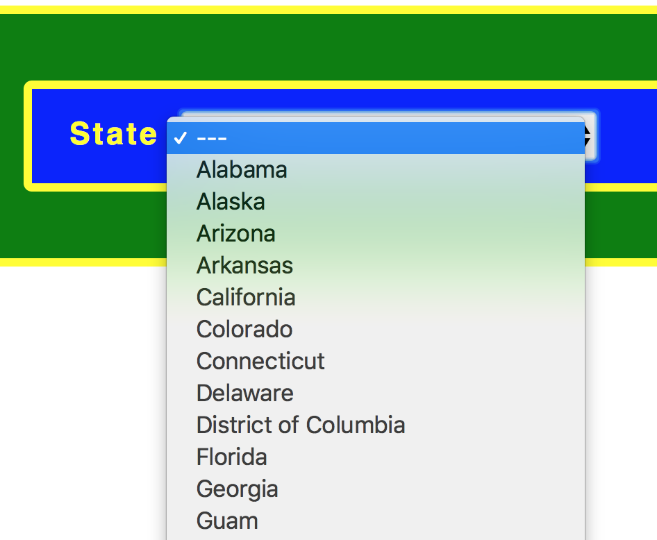
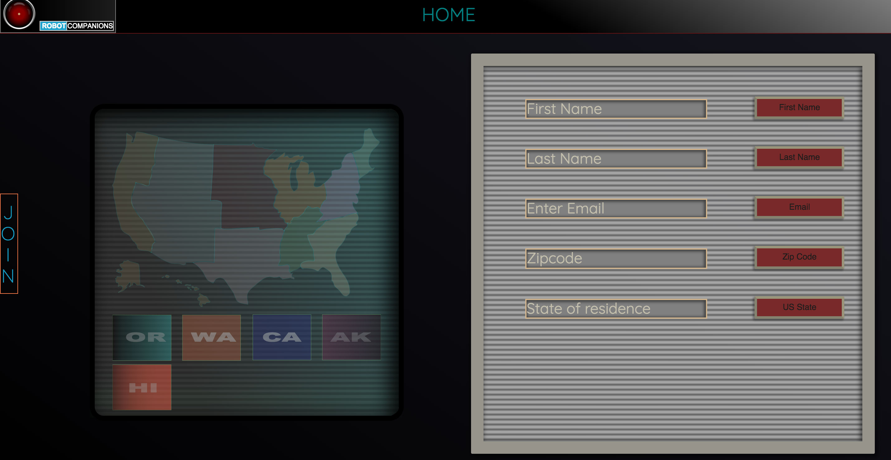
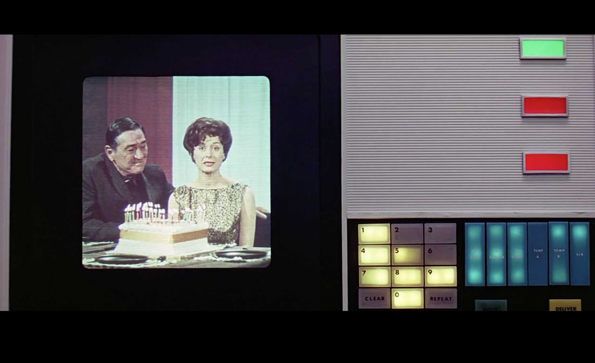
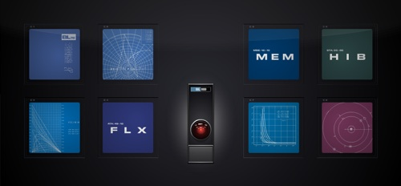
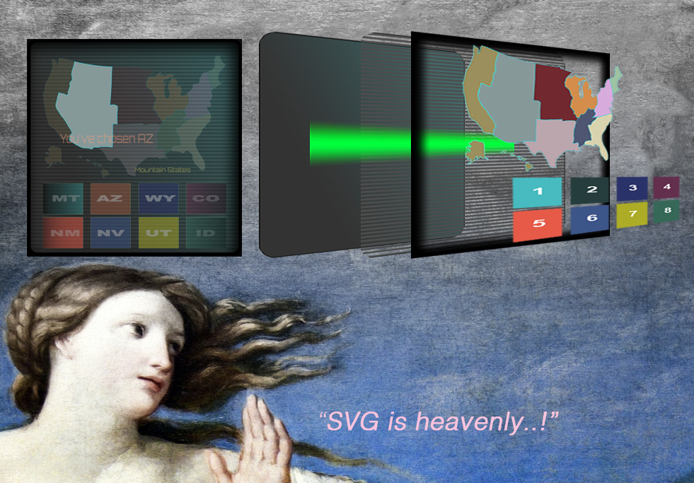
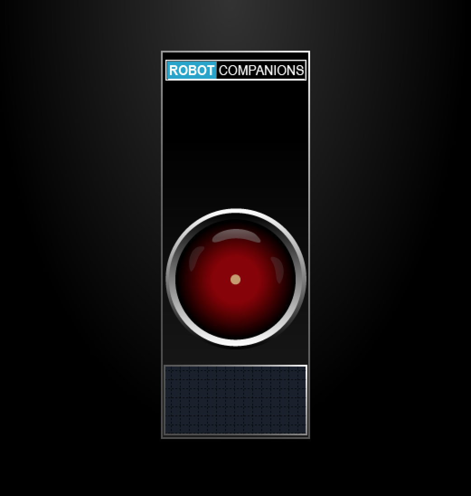
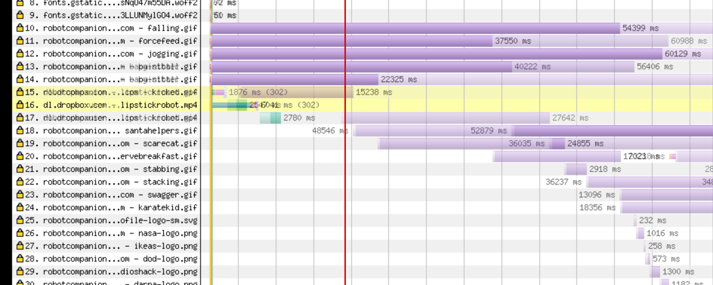
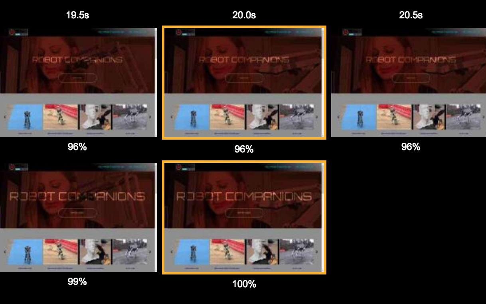

# Robot-Companions: 
## (User Validation app in React 16)

### *font-size Production change* for **public/css/styles.css**

## PLEASE NOTE:

### *Media Queries are, at this moment, being revised*
#### Thanks for your patience.
-- (Jan. 22)

## Feature-set

|<h3>Feature</h3>|<h3>Notes</h3>|<h3>Status</h3>|
|:-----------|:-------|:-------|
|**React**|16.0.0|***√***|
|**Responsivity**|2 breakpoints|***iPad,iPhone7,8,X(with some sizing problems),GalaxyS5***|
|**Normalization**|normalize.css|***√***|
|**Layout**|CSS Grid|***√***|
|**CSS Variables**|in :root{} of stylesheet|***√***|
|**Tiny Stylesheet**|Styled-Components|***√***|
|**Validation**|npm-validator|***√***|
|**Tooling**|Webpack|***√***|
|**babel-core**|env,react|***√***|
|**Animations**|CSS & SVG|***√***|
|**Routes**|React-Router)|***√***|
|**Hosting**|Heroku|***√***|
|**Slider**|Handcoded|***√***|
|**TabIndex Attrs**|a-tags and btns|*Pending*|

-----------------
## Ambitions for this project:

+ A new approach to the (United States) drop-down in the form of a clickable map.
+ Only 9 rules in stylesheet. Almost completely done in styled components.
  Challenged myself to exploit the powers of StyledComponents and theming.
*The cost comes as CSS being parsed twice--by css parser and by the js*

+ Executing audio with the signup page as a short UX response to valid & invalid inputs by the user. (pending)

-----------------
# Notes, Context & some features

The coding challenge was simply to clone the general style of the [Doosan Baseball](http://baseball.doosan.com/)
 & to add a second page with user validation:
- First Name
- Last Name (with dashes and apostrophes)
- email
- US zipcode
- US States Dropdown

In the spirit of the hiker's ethic of "leaving a site nicer than when I found it", I was ambitious to add an improvement or two while trying *not* to do too much damage :).

I met with both success and... "yet-to-be-solved" problems.

## Highlights
-----------------
### Slider (raw js image carousel)

Implemented a version of a slider/carousel within a very few lines of javascript.
After a few hours & tears, it's functional.

This has nowhere near the functionality that the jQuery Owl-Carousel plugin has (used on original site), but I managed a quick and dirty & *very* light-weight version.

...but it's a bicycle--not a Lexus.

(I was as ambitious to do a youtube API... but I didn't want to get too into the weeds with trying to do something impressive--while missing the core points of the coding that was requested which was sign-up and user validation.)

-----------------
### The content/theme

I wanted to give a kind of sinister--but--satirical feel to the idea of AI and the coming "robo-pocalypse". I therefore chose this theme of images and styling.

I took a risk by replacing videos with .gifs and this lead me to a robotics theme. I simply wanted people to smile when they visit.

The cost comes at having delivered a *non*-generic feel to the site I've built.

The larger-(more serious) cost comes at page-load.

15 .gifs with any of up to 100+ frames. The result is it is EXTREEMLY slow.
(I didn't build the slider mindful that close to 1500 images would be loading at once.)

The result is something with a theme of "shitty-robots". https://www.reddit.com/r/shittyrobots/
The Hero video is taken from videos done by a woman who works in robotics.
https://www.patreon.com/simonegiertz

-------------------------
## SVG Vector Display Monitor

Onboarding and signup is a critical process. If a first-visit to a site is a first meeting...the signup is an agreement to start dating. This critical process, when done well, can & ought to be an enjoyable experience. It is a welcome.

Engagement ought to be engaging. So, let's pump up that oxyticin!

Therefore,  instead of a conventional drop-down

I opted for this:

It's a vector display monitor with a glitch.

(I Recently watched Stanley Kubrick's 2001 and liked the drab and deliberately ugly colors.)

I used these two images for reference:

___________

## The above is a combination of the following

1. (SVG) base layer with drab-green linear gradient
2. (SVG) rect with a gradient that runs up the screen every 20s or so with @keyframe animation infinitely.
3. (SVG) single-pixel-wide horizontal lines depicting deinterlacing
4. (CSS) div with inset box-shadow for a vignette 
5. (SVG) A clickable interactive map divided according to US Census Divisions (hoverstate reveals separate "bursts" of color to contrast with the drab style of the entire page and adjacent paneling).
6. (SVG) buttons with corresponding states appear on click.
7. (SVG) finally a resulting "You've chosen VA..." appears offset in the map.  

-----------------
Here is an icon in svg (illustrator) I did for this site.

## Further improvements to be made
+ scrnshot to cover the gifs to simulate playbuttons
+ landscape breakpoints for iphones. --> Now, they look pretty awful.
+ reworking of the color palette and typography.
+ prep data inputs for back-end storage.

-----------------
## CLI commands

+ yarn run build
+ yarn run dev-server
+ yarn run build:prod

-----------------

# What I would do differently:

## Development process reflections & issues:

1. Deprioritized **media queries** during the development. As a result the layout lacks consistency....More difficult targeting of elements, more css, more queries, less fun for the user and developer.

2. **Used rems** for font-sizes. Boo! 🤮 **Implemented Solution**: Perfect use-case for  **css-variables** at :root{} in the stylesheet.

3. **Too much styling** early in the dev-process. 
--Hey, future Self, hook up the damned routes and buttons etc before you screw around with colors and typograpy!
+ Routes, then layout, then styling, then features (capiche?!)

4. Stylistically, landing page above the fold has **too much movement** for the human eye to handle. This is why covering those .gifs with static images would have been a good choice.

5. **Comment more** of the major components!

6. Gif **files are too big**! None are optimized! **Implemented Solution:** gzipped those puppies for a huge win (by comparison). TTP is much sooner (though, the browser/server still hates me).

- The lighter purple represents the original file-size of gifs.
- Darker purple represents current files that are gzipped.
<!--  -->

<!-- 
Code (internal/external for sizing): -->

*Film strip above is the first prod candidate. It is compared to the second which shows a complete load at 1/3rd the speed.*

**Complete load that once took 60s (!!!) now takes 20s** 

--which, yes... still sucks, (but this is only after ONE pass of gzipping gifs)

https://www.webpagetest.org/result/180119_YP_552a762ed78cd3cf4228eb1163d2b67f/

7. **I used id's** for accurate targeting in components which, I forgot, you should never do. It completely defeats the purpose of reuse. (--What use is a component if it's only usable in one place?).