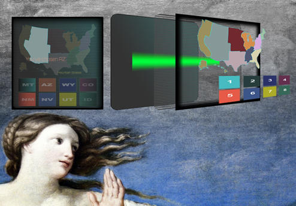

# 2-Page-App

## Feature-set

|<h3>Feature</h3>|<h3>Notes</h3>|<h3>Status</h3>|
|:-----------|:-------|:-------|
|**Slider**|handcoded|***√***|
|**Responsivity**|media queries|***iPad,iPhone7,8,X(with some sizing problems),GalaxyS5***|
|**Layout**|CSS Grid|***√***|
|**CSS Reset**|Normalize|***√***|
|**Authentification**|npm-validator|***√***|
|**React**|16.0.0|***√***|
|**Webpack**|watch/web-server|***√***|
|**babel-core**|env,react|***√***|
|**Animations**|CSS & SVG|***√***|
|**Routes**|one(plus one for components)|***√***|
|**production build/hosted**|"yarn run build:prod"|***√***|
|**normalized**|normalize.css|***√***|
|**TabIndex Attrs**|a-tags and btns|*Pending*|
|**CSS Variables**|in :root{} of stylesheet|*Pending*|

## Ambitions for this project:

+ A new approach to the (United States) drop-down in the form of a clickable map.
+ No CSS file. As a proof of concept, I want to do a first website without a CSS file.
  This would challenge me to exploit the nature of StyledComponents and theming & take me out of my comfort-zone.
*The cost comes as CSS being parsed twice--by css parser and by the js*

+ Executing audio with the signup page as a short UX response to valid & invalid inputs by the user.

## Further improvements to be made
+ scrnshot to cover the gifs to simulate playbuttons
+ landscape breakpoints for iphones. --> Now, they look pretty awful.
+ reworking of the color palette and typography.
+ prep data inputs for back-end storage.

## Pre-launch TODOS

local-host renders a font 1/3rd the size of hosted site. Therefore,
css var to be changed from 20 to 30px prior to "build:prod" command &
push to servers for hosted site.

## CLI commands

+ yarn run build
+ yarn run dev-server
+ yarn run build:prod

# Notes, Context & some features

The coding challenge was simply to clone the general style of the following website & to add a second page with
- user validation
- First Name
- Last Name (with dashes and apostrophes)
- email
- US zipcode
- US States Dropdown

[Doosan Baseball](http://baseball.doosan.com/)

In the spirit of the hiker's ethic of "leaving a site nicer than when I found it", I was ambitious to add an improvement or two while trying *not* to do too much damage :).

I met with both success and... "yet-to-be-solved" problems.

## Highlights

### Slider

I implemented a version of a slider/carousel within a very few lines of javascript.
After a few tears & swears, it's functional.

It has nowhere near the functionality that the jQuery Owl-Carousel plugin has (used on original site), but I managed a quick and dirty & *very* light-weight version.

...but it's a bicycle--not a Lexus.

I was as ambitious to do a youtube API... but I didn't want to get too into the weeds with trying to do something impressive--while missing the core points of the coding that was requested which was sign-up and user validation.

### The content

I wanted to give a kind of sinister--but--satirical feel to the idea of AI and the coming "robo-pocalypse". I therefore chose this theme of images and styling.

I took a risk by replacing videos with .gifs and this lead me to a robotics theme. I simply wanted people to smile when they visit.

The cost comes at having delivered a *non*-generic feel to the site I've built.

The larger-(more serious) cost comes at page-load.

15 .gifs with any of up to 100+ frames. The result is it is EXTREEMLY slow.
(I didn't build the slider mindful that close to 1500 images would be loading at once.)

Anyway... The result is something with a theme of "shitty-robots". The Hero video is taken from videos done by a woman who works in robotics and is brilliant & funny.

Onboarding and signup is a critical process. If a first-visit to a site is a first meeting...the signup is an agreement to start dating. This critical process, when done well, can & ought to be an enjoyable experience. It is a welcome.

Engagement ought to be engaging. So, let's pump up that oxyticin!

Therefore,  instead of a conventional drop-down

I opted for this:

-------------------------

I'm happy with it. It's a cathode computer monitor with a glitch.

(Recently watched Stanley Kubrick's 2001 and I really liked the drab and deliberately ugly colors...)

I used these two images for reference:

___________
+ base SVG layer with drab linear gradient
+ (SVG) single-pixel-wide horizontal lines depicting deinterlacing
+ (SVG) rect with a gradient that runs up the screen every 20s or so with @keyframe animation infinitely.
+ (CSS) div with inset box-shadow for a vignette
+ (SVG) A clickable interactive map divided according to US Census Divisions (hoverstate reveals separate "bursts" of color to contrast with the drab style of the entire page and adjacent paneling)
+ (SVG) buttons with corresponding states appear on click.
+ (SVG) finally a resulting "You've chosen VA..." appears offset in the map.

-----------------

This has been I'm having a lot of fun doing this. (And I won't stop :) )

Here is an icon in svg (illustrator) I did for this site.

# For future notice:
## I made some important mistakes (--each, easily avoidable).

1. Deprioritized **media queries** during the development. As a result the layout lacks consistancy....More difficult targeting of elements, more css, more queries, less fun for the user and developer.
2. **Used rems** for font-sizes only to discover later that they are, indeed, relative. Problem still exists as I write this.--Solution: No better time than the present to pull out some **css-variables** magic to solve the problem!
3. **Too much styling** early in the dev-process. 
--Hey, future Self, hook up the damned routes and buttons etc before you screw around with colors and typograpy!
+ Routes, then layout, then styling, then features (capiche?!)

4. Be aware that landing page, above the fold, has way WAY **too much movement** for the human eye to handle. This is why covering those .gifs with static images would have been a good choice.
5. **Comment more** of the major components!

(There are more things I'd like to change and I will. But now, I need rest.)
